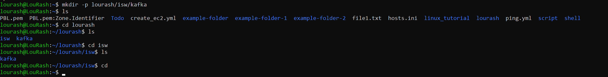

"# Linux File Manipulation" 

Basic Linux Commands: Introduction to command line operations, file and directory management.


##  1.  Sudo

Short for Superuserdo, this is used for task that/commands that requires administrative or root permissions. The general syntax is 

```bash
sudo (command)```

e.g 
```markdown
sudo apt upgrade
```


##  2.  pwd command:

use the pwd to find the path if your current/present working directory. i.e 

```markdown
pwd [option]
```
-L : Logical prints the enviroment variable content inc


## 3. `cd` Command
- **Purpose**: Used to navigate through Linux files and directories.

```markdown
cd ..
``` 
moves one directory up.
```markdown
cd -
``` 
moves to your previous directory.

- **Usage**: `cd [/home/lourash/Todo/routes]` changes the current directory.
  - Running `cd` without any arguments takes you to the home directory.
- **Example**: To navigate to a subdirectory named 'Todo' in the current directory, use `cd Todo`.
- 

## 4. `ls` Command
- **Purpose**: Lists files and directories within a system.
- **Usage**: `ls [options] [path]` displays contents of a directory.
  - Without any arguments, it lists contents of the current directory.
- **Options**:
  - `-a`: Lists all files, including hidden ones.
  - `-l`: Shows detailed information like file sizes in readable formats.
- **Example**: To view files in the '/home/lourash/Todo' folder, use `ls Docume/home/lourash/Todonts`.
-  


##  5.	cat command:
Concatenate, or cat, is one of the most frequently used Linux commands. It lists, combines, and writes file content to the standard output. To run the cat command, type cat followed by the le name and its extension. For instance

cat aspfep.txt


cat aspfep.txt create_ec2.yml > file.txt


```markdown
tac aspfep.txt 
```

displays content in reverse order.


6.	cp command:
Use the cp command to copy files or directories and their content. Take a look at the following use cases.
To copy one file from the current directory to another, enter cp followed by the file name and the destination directory. For example:

```bash
cp aspfep.txt /home/lourash/Todo
```


To copy files to a directory, enter the file names followed by the destination directory: follow this format below

```bash
cp aspfep.txt file.txt /home/lourash/Todo
```

To copy the content of a file to a new file in the same directory, enter cp followed by the source file and the destination file as show below:
 
 
```bash
cp aspfep.txt file.txt
```

To copy an entire directory, pass the -R flag before typing the source directory, followed by the destination directory:

```bash
cp -R /home/username/Documents /home/username/Documents_backup
```

7.	mv command:
The primary use of the mv command is to move and rename files and directories. Additionally, it doesn’t produce an output upon execution.
Simply type mv followed by the filename and the destination directory. For example, you want to move to the
/home/username/Documents directory: for example

```markdown
mv aspfep.txt /home/lourash/Todo
```


You can also use the mv command to rename a file

```markdown
mv file.txt file1.txt
```


##  8.	mkdir command:
Use the mkdir command to create one or multiple directories at once and set permissions for each of them. The user executing this command must have the privilege to make a new folder in the parent directory, or they may receive a permission denied error.
Here’s the basic syntax:
mkdir [option] directory_name

For example, you want to create a directory called Lourash:

```markdown
mkdir lourash
```


To make a new directory called kafka inside lourash, use this command:

```markdown
mkdir lourash/kafka
```


The mkdir command accepts many options, such as:
-p or –parents create a directory between two existing folders. For example, mkdir -p lourash/isw/kafka will make the new “isw” directory. -m sets the file permissions. For instance, to create a directory with full read, write, and execute permissions for all users, enter mkdir -m777 directory_name. -v prints a message for each created directory.



##  9.	rmdir command:
To permanently delete an empty directory, use the rmdir command. Remember that the user running this command should have sudo privileges in the parent directory.
For example, you want to remove an empty subdirectory named isw and its main folder lourash:

```markdown
rmdir -p lourash/kafka
```


##  10.	rm command:
The rm command is used to delete files within a directory. Make sure that the user performing this command has write permissions.
Remember the directory’s location as this will remove the file(s) and you can’t undo it.
Here’s the general syntax:
 
To remove multiple files, enter the following command:
 
```markdown
 rm filename
```
 
Copy Below Code rm filename1 filename2 filename3
Here are some acceptable options you can add:
-i prompts system confirmation before deleting a file. 
```markdown
rm filename -i
```
-f allows the system to remove without a confirmation. -r deletes files and directories recursively.
```markdown
rm filename -f
```

11.	touch command:
The touch command allows you to create an empty le or generate and modify a timestamp in the Linux command line.
For example, enter the following command to create an HTML file named Web in the Documents directory:

```markdown
touch sqlite_commands.sh
```


12.	locate command:
The locate command can find a file in the database system.
Moreover, adding the -i argument will turn off case sensitivity, so you can search for a le even if you don’t remember its exact name.
To look for content that contains two or more words, use an asterisk (*). For example:
```markdown
locate -i school*note
```
The command will search for files that contain the words school 


13.	find command:
Use the find command to search for files within a specific directory and perform subsequent operations. Here’s the general syntax:
 
```markdown
 find [option] [path] [expression]
```


For example, you want to look for a file called sql_commands.sh within the home directory and its subfolders:
 
Here are other variations when using find:
find -name filename.txt to find files in the current directory. find ./ -type d -name directoryname to look for directories.


14.	grep command:
Another basic Linux command on the list is grep or global regular expression print. It lets you find a word by searching through all the texts in a specific file.
Once the grep command nds a match, it prints all lines that contain the specific pattern. This command helps filter through large log files.
For example, you want to search for the word ec2 in the file1.txt file
 
```markdown
grep values sql_commands.sh
```
The command’s output will display lines that contain ec2.


15.	df command:
Use the df command to report the system’s disk space usage, shown in percentage and kilobyte (KB). Here’s the general syntax:
 
 
```bash
df [options] [file]
```
For example, enter the following command if you want to see the current directory’s system disk space usage in a humanreadable format:
 
These are some acceptable options to use:
df -m displays information on the file system usage in MBs. df -k displays file system usage in KBs. df -T shows the file system type in a new column.


16.	du command:
If you want to check how much space a file or a directory takes up, use the du command. You can run this command to identify which part of the system uses the storage excessively.
Remember, you must specify the directory path when using the du command. For example, to check /home/ubuntu/CommandLinux enter:

```markdown
du /home/ubuntu/CommandsLinux
```


Adding a flag to the du command will modify the operation, such as:
-s offers the total size of a specified folder. -m provides folder and file information in MB k displays information in KB. -h informs the last modification date of the displayed folders and files.


17. head command:
The head command allows you to view the rst ten lines of a text. Adding an option lets you change the number of lines shown. The head command is also used to output piped data to the CLI.
Here’s the general syntax:

```markdown
 head [option] [file]
```


For instance, you want to view the first ten lines of deploy1.yml, located in the current directory:
 
-n or –lines prints the rst customized number of lines. For example, enter head -n 5 filename.txt to show the first five lines of filename.txt. -c or –bytes prints the first customized number of bytes of each file. -q or –quiet will not print headers specifying the file name.


18.	**tail command:**
The tail command displays the last ten lines of a file. It allows users to check whether a file has new data or to read error messages.
Here’s the general format:

```markdown
tail [option] [file]
```
For example, you want to show the last ten lines of the create_ec2.yml file:


19.	diff command:
Short for difference, the diff command compares two contents of a file line by line. After analyzing them, it will display the parts that do not match.
Programmers often use the diff command to alter a program instead of rewriting the entire source code.
Here’s the general format:
```markdown
diff [option] file1 file2
```
For example, you want to compare two files – file1.txt and create_ec2.yml
 
 
```markdown
diff create_ec2.yml file1.txt
```
 

Here are some acceptable options to add:
-c displays the difference between two files in a context form. -u displays the output without redundant information. -i makes the diff command case insensitive.


20. tar command:
The tar command archives multiple les into a TAR le – a common Linux format similar to ZIP, with optional compression.
Here’s the basic syntax:
 	
 
 

For instance, you want to create a new TAR archive named newarchive.tar in the /home/ubuntu directory: you can edit the code below to suit your purpose.
 	
 
 

The tar command accepts many options, such as: -x extracts a le.
-t	lists the content of a le.
-u	archives and adds to an existing archive le.
