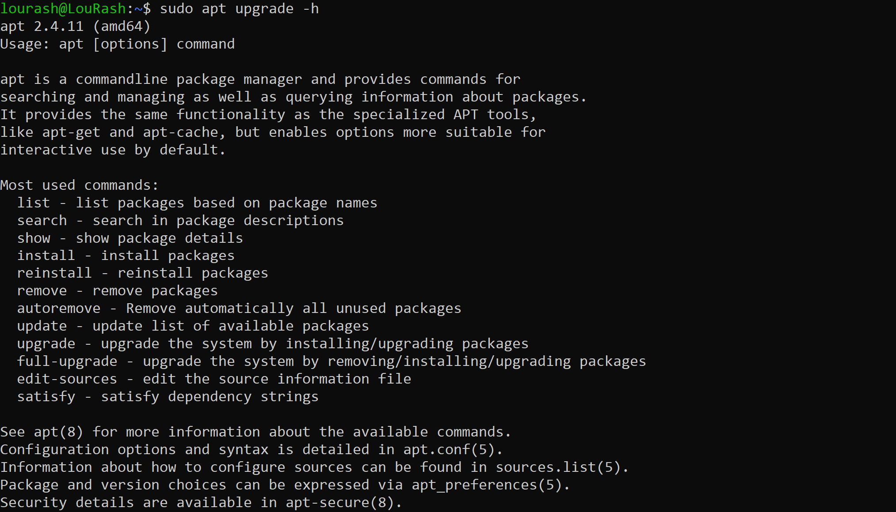

"# Linux File Manipulation" 

Basic Linux Commands: Introduction to command line operations, file and directory management.


##  1.  Sudo

Short for Superuserdo, this is used for task that/commands that requires administrative or root permissions. The general syntax is 

```bash
sudo (command)```

e.g 
```markdown
sudo apt upgrade
```





##  2.  pwd command:

use the pwd to find the path if your current/present working directory. i.e 

```markdown
pwd [option]
```
-L : Logical prints the enviroment variable content inc


## 3. `cd` Command
- **Purpose**: Used to navigate through Linux files and directories.

```markdown
cd ..
``` 
moves one directory up.
```markdown
cd -
``` 
moves to your previous directory.

- **Usage**: `cd [/home/lourash/Todo/routes]` changes the current directory.
  - Running `cd` without any arguments takes you to the home directory.
- **Example**: To navigate to a subdirectory named 'Todo' in the current directory, use `cd Todo`.
- 

## 4. `ls` Command
- **Purpose**: Lists files and directories within a system.
- **Usage**: `ls [options] [path]` displays contents of a directory.
  - Without any arguments, it lists contents of the current directory.
- **Options**:
  - `-a`: Lists all files, including hidden ones.
  - `-l`: Shows detailed information like file sizes in readable formats.
- **Example**: To view files in the '/home/lourash/Todo' folder, use `ls Docume/home/lourash/Todonts`.
-  

