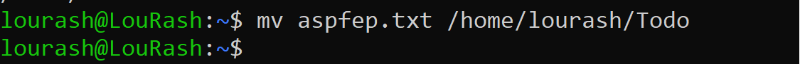
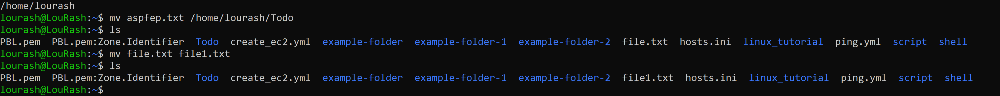
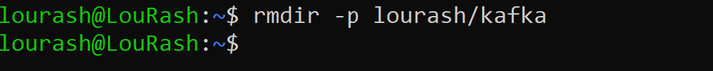
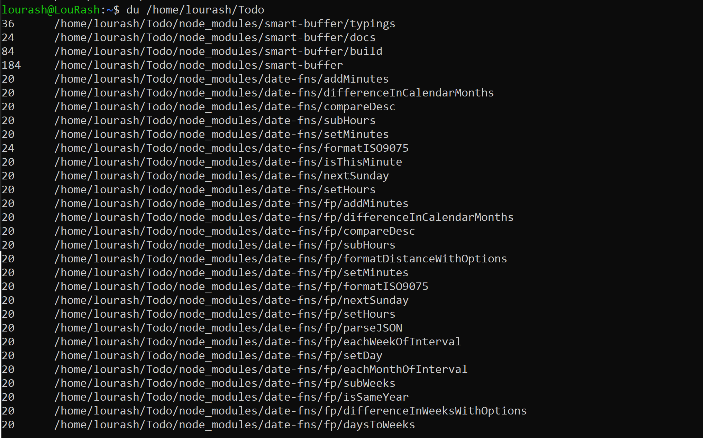

Linux File Manipulation

Basic Linux Commands: Introduction to command line operations, file and directory management.


##  1.  Sudo

Short for Superuserdo, this is used for task that/commands that requires administrative or root permissions. The general syntax is 

```bash
sudo (command)```

e.g 
```markdown
sudo apt upgrade
```


##  2.  pwd command:

use the pwd to find the path if your current/present working directory. i.e 

```markdown
pwd [option]
```
-L : Logical prints the enviroment variable content inc


## 3. `cd` Command
- **Purpose**: Used to navigate through Linux files and directories.

```markdown
cd ..
``` 
moves one directory up.
```markdown
cd -
``` 
moves to your previous directory.

- **Usage**: `cd [/home/lourash/Todo/routes]` changes the current directory.
  - Running `cd` without any arguments takes you to the home directory.
- **Example**: To navigate to a subdirectory named 'Todo' in the current directory, use `cd Todo`.
- 

## 4. `ls` Command
- **Purpose**: Lists files and directories within a system.
- **Usage**: `ls [options] [path]` displays contents of a directory.
  - Without any arguments, it lists contents of the current directory.
- **Options**:
  - `-a`: Lists all files, including hidden ones.
  - `-l`: Shows detailed information like file sizes in readable formats.
- **Example**: To view files in the '/home/lourash/Todo' folder, use `ls Docume/home/lourash/Todonts`.
-  


##  5.	cat command:
Concatenate, or cat, is one of the most frequently used Linux commands. It lists, combines, and writes file content to the standard output. To run the cat command, type cat followed by the le name and its extension. For instance

cat aspfep.txt


cat aspfep.txt create_ec2.yml > file.txt


```markdown
tac aspfep.txt 
```

displays content in reverse order.


6.	cp command:
Use the cp command to copy files or directories and their content. Take a look at the following use cases.
To copy one file from the current directory to another, enter cp followed by the file name and the destination directory. For example:

```bash
cp aspfep.txt /home/lourash/Todo
```


To copy files to a directory, enter the file names followed by the destination directory: follow this format below

```bash
cp aspfep.txt file.txt /home/lourash/Todo
```

To copy the content of a file to a new file in the same directory, enter cp followed by the source file and the destination file as show below:
 
 
```bash
cp aspfep.txt file.txt
```

To copy an entire directory, pass the -R flag before typing the source directory, followed by the destination directory:

```bash
cp -R /home/username/Documents /home/username/Documents_backup
```

7.	mv command:
The primary use of the mv command is to move and rename files and directories. Additionally, it doesn’t produce an output upon execution.
Simply type mv followed by the filename and the destination directory. For example, you want to move to the
/home/username/Documents directory: for example

```markdown
mv aspfep.txt /home/lourash/Todo
```


You can also use the mv command to rename a file

```markdown
mv file.txt file1.txt
```



##  8.	mkdir command:
Use the mkdir command to create one or multiple directories at once and set permissions for each of them. The user executing this command must have the privilege to make a new folder in the parent directory, or they may receive a permission denied error.
Here’s the basic syntax:
mkdir [option] directory_name

For example, you want to create a directory called Lourash:

```markdown
mkdir lourash
```


To make a new directory called kafka inside lourash, use this command:

```markdown
mkdir lourash/kafka
```


The mkdir command accepts many options, such as:
-p or –parents create a directory between two existing folders. For example, mkdir -p lourash/isw/kafka will make the new “isw” directory. -m sets the file permissions. For instance, to create a directory with full read, write, and execute permissions for all users, enter mkdir -m777 directory_name. -v prints a message for each created directory.


##  9.	rmdir command:
To permanently delete an empty directory, use the rmdir command. Remember that the user running this command should have sudo privileges in the parent directory.
For example, you want to remove an empty subdirectory named isw and its main folder lourash:

```markdown
rmdir -p lourash/kafka
```



##  10.	rm command:
The rm command is used to delete files within a directory. Make sure that the user performing this command has write permissions.
Remember the directory’s location as this will remove the file(s) and you can’t undo it.
Here’s the general syntax:
 
To remove multiple files, enter the following command:
 
```markdown
 rm filename
```
 
```markdown
rm filename1 filename2 filename3
```
Here are some acceptable options you can add:
-i prompts system confirmation before deleting a file. 
```markdown
rm filename -i
```
-f allows the system to remove without a confirmation. -r deletes files and directories recursively.
```markdown
rm filename -f
```

11.	touch command:
The touch command allows you to create an empty le or generate and modify a timestamp in the Linux command line.
For example, enter the following command to create an HTML file named Web in the Documents directory:

```markdown
touch sqlite_commands.sh
```


12.	locate command:
The locate command can find a file in the database system.
Moreover, adding the -i argument will turn off case sensitivity, so you can search for a le even if you don’t remember its exact name.
To look for content that contains two or more words, use an asterisk (*). For example:
```markdown
locate -i school*note
```
The command will search for files that contain the words school 


13.	find command:
Use the find command to search for files within a specific directory and perform subsequent operations. Here’s the general syntax:
 
```markdown
 find [option] [path] [expression]
```


For example, you want to look for a file called sql_commands.sh within the home directory and its subfolders:
 
Here are other variations when using find:
find -name filename.txt to find files in the current directory. find ./ -type d -name directoryname to look for directories.


14.	grep command:
Another basic Linux command on the list is grep or global regular expression print. It lets you find a word by searching through all the texts in a specific file.
Once the grep command nds a match, it prints all lines that contain the specific pattern. This command helps filter through large log files.
For example, you want to search for the word ec2 in the file1.txt file
 
```markdown
grep values sql_commands.sh
```
The command’s output will display lines that contain ec2.


15.	df command:
Use the df command to report the system’s disk space usage, shown in percentage and kilobyte (KB). Here’s the general syntax:
 
 
```bash
df [options] [file]
```
For example, enter the following command if you want to see the current directory’s system disk space usage in a humanreadable format:
 
These are some acceptable options to use:
df -m displays information on the file system usage in MBs. df -k displays file system usage in KBs. df -T shows the file system type in a new column.


16.	du command:
If you want to check how much space a file or a directory takes up, use the du command. You can run this command to identify which part of the system uses the storage excessively.
Remember, you must specify the directory path when using the du command. For example, to check /home/ubuntu/CommandLinux enter:

```markdown
du /home/ubuntu/CommandsLinux
```



Adding a flag to the du command will modify the operation, such as:
-s offers the total size of a specified folder. -m provides folder and file information in MB k displays information in KB. -h informs the last modification date of the displayed folders and files.


17. head command:
The head command allows you to view the rst ten lines of a text. Adding an option lets you change the number of lines shown. The head command is also used to output piped data to the CLI.
Here’s the general syntax:

```markdown
 head [option] [file]
```


For instance, you want to view the first ten lines of deploy1.yml, located in the current directory:
 
-n or –lines prints the rst customized number of lines. For example, enter head -n 5 filename.txt to show the first five lines of filename.txt. -c or –bytes prints the first customized number of bytes of each file. -q or –quiet will not print headers specifying the file name.


18.	**tail command:**
The tail command displays the last ten lines of a file. It allows users to check whether a file has new data or to read error messages.
Here’s the general format:

```markdown
tail [option] [file]
```
For example, you want to show the last ten lines of the create_ec2.yml file:


19.	diff command:
Short for difference, the diff command compares two contents of a file line by line. After analyzing them, it will display the parts that do not match.
Programmers often use the diff command to alter a program instead of rewriting the entire source code.
Here’s the general format:
```markdown
diff [option] file1 file2
```
For example, you want to compare two files – file1.txt and create_ec2.yml
 
 
```markdown
diff create_ec2.yml file1.txt
```
 

Here are some acceptable options to add:
-c displays the difference between two files in a context form. -u displays the output without redundant information. -i makes the diff command case insensitive.


20. tar command:
The tar command archives multiple files into a TAR file – a common Linux format similar to ZIP, with optional compression.
Here’s the basic syntax:
 	
 ```markdown
 tar [options] [archive_file] [file or directory to be archived]
 ```

 

For instance, you want to create a new TAR archive named newarchive.tar in the /home/lourash directory: you can edit the code below to suit your purpose.
 	
```markdown
 tar -cvf newarchive.tar /home/lourash
```

 

The tar command accepts many options, such as: -x extracts a file.
-t	lists the content of a file.
-u	archives and adds to an existing archive file.


**Introduction to Linux and Basic Commands**
Linux is a family of open-source Unix operating systems based on the Linux Kernel. They include Ubuntu, Fedora, Debian, openSUSE, and Red Hat. Using Linux to manage a Virtual Private Server (VPS) is common practice.
When operating Linux, you need to use a shell – a program that gives you access to the operating system’s services. Most Linux distributions use a graphical user interface (GUI), making them beginner-friendly.
However, we recommend utilizing the command-line interface (CLI) because it’s quicker and offers more control. Tasks that require multiple steps on the GUI can be done in a matter of seconds by entering commands into the CLI.
So if you want to use Linux, learning the common utilities or commands will go a long way.
What Is a Linux Command?
A Linux command is a program or utility that runs on the CLI – a console that interacts with the system via texts and processes. It’s similar to the Command Prompt application in Windows.
Linux commands are executed on Terminal by pressing Enter at the end of the line. You can run commands to perform various tasks, from package installation to user management and file manipulation.
Here’s what a Linux command’s general syntax looks like:

```markdown
CommandName [option(s)] [parameter(s)]
```

A command may contain an option or a parameter. In some cases, it can still run without them. These are the three most common parts of a command:

CommandName is the rule that you want to perform. Option or flag modifies a command’s operation. To invoke it, use hyphens (–) or double hyphens (—).
Parameter or argument specifies any necessary information for the command.

TAKE NOTE
1.	All Linux commands are case-sensitive
2.	For persons who do not have access to a linux machine you can access a light weight linux machine [here](https://bellard.org/jslinux/) free of charges
If you have clicked on the link above, pick a linux machine


Then, wait for sometime for it to come up. There you go! you have your linux machine. With it you can practice all your linux commands


File Permissions and Ownership
21. chmod command:
chmod is a common command that modifies a file or directory’s read, write, and execute permissions. In Linux, each file is associated with three user classes – owner, group member, and others.
Here’s the basic syntax:
 	
```markdown
chmod [option] [permission] [file_name]
```
 
For example, the owner is currently the only one with full permissions to change note.txt. To allow group members and others to read, write, and execute the file, change it to the -rwxrwxrwx permission type, whose numeric value is 777:

```markdown
chmod 777 ping.yml
```


This command supports many options, including:
-c or –changes displays information when a change is made. -f or –silent suppresses the error messages. -v or –verbose displays a diagnostic for each processed file.

22.	chown command:
The chown command lets you change the ownership of a file, directory, or symbolic link to a specified username.
Here’s the basic format:
 	
```markdown
chown [option] owner[:group] file(s)
```
 
For example, you want to make lourash the owner of file1.txt:
 
 
```markdown
chown lourash file1.txt
```


23.	jobs command:
A job is a process that the shell starts. The jobs command will display all the running processes along with their statuses.
Remember that this command is only available in csh, bash, tcsh, and ksh shells.
This is the basic syntax:
 
 
```markdown
jobs [options] jobID
```
To check the status of jobs in the current shell, simply enter jobs to the CLI.
Here are some options you can use:
-l lists process IDs along with their information. -n lists jobs whose statuses have changed since the last notification. -p lists process IDs only.


24. kill command:
Use the kill command to terminate an unresponsive program manually. It will signal misbehaving applications and instruct them to close their processes.
To kill a program, you must know its process identification number (PID). If you don’t know the PID, run the following command:
 	
 
 

After knowing what signal to use and the program’s PID, enter the following syntax:
 
 
```bash
kill [signal_option] pid
```
There are 64 signals that you can use, but these two are among the most commonly used:
SIGTERM requests a program to stop running and gives it some time to save all of its progress. The system will use this by default if you don’t specify the signal when entering the kill command. SIGKILL forces programs to stop, and you will lose unsaved progress. For example, the program’s PID is 63773, and you want to force it to stop:
 
 
 
```markdown
kill SIGKILL 1059
```

25.	ping command:
The ping command is one of the most used basic Linux commands for checking whether a network or a server is reachable.
In addition, it is used to troubleshoot various connectivity issues.
Here’s the general format:
 	
 
 

For example, you want to know whether you can connect to Google and measure its response time:
 
 
```markdown
ping google.com
```
 


 26.	wget command:
The Linux command line lets you download files from the internet using the wget command. It works in the background without hindering other running processes.
The wget command retrieves les using HTTP, HTTPS, and FTP protocols. It can perform recursive downloads, which transfer website parts by following directory structures and links, creating local versions of the web pages.
To use it, enter the following command:
 
 
```markdown
wget [option] [url]
```

For example, enter the following command to download the latest version of WordPress:
 	
```markdown
wget https://wordpress.org/latest.zip
```

 
27.	uname command:
The uname or unix name command will print detailed information about your Linux system and hardware. This includes the machine name, operating system, and kernel. To run this command, simply enter uname into your CLI.
Here’s the basic syntax:
 	
```markdown
 uname [option]
```
These are the acceptable options to use:
-a prints all the system information. -s prints the kernel name. -n prints the system’s node hostname.


28.	top command:
The top command in Linux Terminal will display all the running processes and a dynamic real-time view of the current system. It sums up the resource utilization, from CPU to memory usage.
The top command can also help you identify and terminate a process that may use too many system resources.
To run the command, simply enter top into the CLI.
 	
```bash
top
```


29.	history command:
With history, the system will list up to 500 previously executed commands, allowing you to reuse them without reentering. Keep in mind that only users with sudo privileges can execute this command. How this utility runs also depends on which Linux shell you use.
To run it, enter the command below:
```markdown
history [option]
```
This command supports many options, such as:
-c clears the complete history list. -d offset deletes the history entry at the OFFSET position. -a appends history lines.


30.	man command:
The man command provides a user manual of any commands or utilities you can run in Terminal, including the name, description, and options.
It consists of nine sections:
Executable programs or shell commands System calls Library calls Games Special files File formats and conventions System administration commands Kernel routines Miscellaneous To display the complete manual, enter:
 
 
```markdown
man [command_name]
```
For example, you want to access the manual for the ls command:
 	
```markdown
man ls
```
Enter this command if you want to specify the displayed section:
```markdown
man [option] [section_number] [command_name]
```
 
For instance, you want to see section 2 of the ls command manual:
```markdown
man 2 ls
```
	
 
 
31.	echo command:
The echo command is a built-in utility that displays a line of text or string using the standard output. Here’s the basic syntax:
```markdown
echo [option] [string]
```
This command supports many options, such as:
-n displays the output without the trailing newline. -e enables the interpretation of the following backslash escapes: \a plays sound alert. \b removes spaces in between a text. \c produces no further output. -E displays the default option and disables the interpretation of backslash escapes.

	

32. zip, unzip commands:
Use the zip command to compress your files into a ZIP file, a universal format commonly used on Linux. It can automatically choose the best compression ratio.
The zip command is also useful for archiving files and directories and reducing disk usage.
To use it, enter the following syntax:
 
 
```markdown
zip [options] zipfile file1 file2….
```
For example, you have a file named note.txt that you want to compress into archive.zip in the current directory:
```markdown
zip archive.zip note.txt
```

	
On the other hand, the unzip command extracts the zipped files from an archive. Here’s the general format:
 
 
 ```markdown
 unzip [option] file_name.zip
 ```
So, to unzip a file called archive.zip in the current directory, enter:
 ```markdown
 unzip archive.zip
 ```
 	


33.  hostname command:
Run the hostname command to know the system’s hostname. You can execute it with or without an option. Here’s the general syntax:
 
 
```markdown
hostname [option]
```
There are many optional flags to use, including:
-a or –alias displays the hostname’s alias. -A or –all-fqdns displays the machine’s Fully Quali ed Domain Name (FQDN). -i or –ip-address displays the machine’s IP address. For example, enter the following command to know your computer’s IP address:


 
 

34. useradd, userdel commands:
Linux is a multi-user system, meaning more than one person can use it simultaneously. useradd is used to create a new account, while the passwd command allows you to add a password. Only those with root privileges or sudo can run the useradd command.
When you use the useradd command, it performs some major changes:
Edits the /etc/passwd, /etc/shadow, /etc/group, and /etc/gshadow les for the newly created accounts. Creates and populates a home directory for the user. Sets le permissions and ownerships to the home directory. Here’s the basic syntax:
 
 
```markdown
useradd [option] username To set the password:
```
```markdown
passwd the_password_combination
```
For example, to add a new person named John, enter the following command simultaneously:
```markdown
sudo useradd John
sudo passwd 123456789
```
To delete a user account, use the userdel command:
 
```markdown
 userdel username
```
35.	apt-get command:
apt-get is a command line tool for handling Advanced Package Tool (APT) libraries in Linux. It lets you retrieve information and bundles from authenticated sources to manage, update, remove, and install software and its dependencies.
Running the apt-get command requires you to use sudo or root privileges.
Here’s the main syntax:
```markdown
apt-get [options] (command)
```
These are the most common commands you can add to apt-get:
update synchronizes the package files from their sources. upgrade installs the latest version of all installed packages. check updates the package cache and checks broken dependencies.


36.	nano, vi, jed commands:
Linux allows users to edit and manage files via a text editor, such as nano, vi, or jed. nano and vi come with the operating system, while jed has to be installed.
The nano command denotes keywords and can work with most languages. To use it, enter the following command:
 
 
```markdown
nano [filename]
```
vi uses two operating modes to work – insert and command. insert is used to edit and create a text file. On the other hand, the command performs operations, such as saving, opening, copying, and pasting a file.
To use vi on a fie, enter:
 	
```markdown
 vi [filename]
```

 

jed has a drop-down menu interface that allows users to perform actions without entering keyboard combinations or commands. Like vi, it has modes to load modules or plugins to write speci c texts.
To open the program, simply enter jed to the command line.


37.	alias, unalias commands:
alias allows you to create a shortcut with the same functionality as a command, file name, or text. When executed, it instructs the shell to replace one string with another.
To use the alias command, enter this syntax:
```markdown
alias Name=String
```
For example, you want to make k the alias for the kill command:
 ```markdown
 alias k=’kill’
 ```
	
 
 

On the other hand, the unalias command deletes an existing alias.
Here’s what the general syntax looks like:
 
 
```markdown
unalias [alias_name]
```

38.	su command:
The switch user or su command allows you to run a program as a different user. It changes the administrative account in the current log-in session. This command is especially beneficial for accessing the system through SSH or using the GUI display manager when the root user is unavailable.
Here’s the general syntax of the command:
 
 
```markdown
su [options] [username [argument]]
```
When executed without any option or argument, the su command runs through root privileges. It will prompt you to authenticate and use the sudo privileges temporarily.
Here are some acceptable options to use:
-p or –preserve-environment keeps the same shell environment, consisting HOME, SHELL, USER, and LOGNAME. -s or – shell lets you specify a different shell environment to run. -l or –login runs a login script to switch to a different username.
Executing it requires you to enter the user’s password.
39. htop command:
The htop command is an interactive program that monitors system resources and server processes in real time. It is available on most Linux distributions, and you can install it using the default package manager.
Compared to the top command, htop has many improvements and additional features, such as mouse operation and visual indicators.
To use it, run the following command:
 	
```markdown
 htop [options]
```

 

You can also add options, such as:
-d or –delay shows the delay between updates in tenths of seconds. -C or –no-color enables the monochrome mode. -h or – help displays the help message and exit.


40. ps command:
The process status or ps command produces a snapshot of all running processes in your system. The static results are taken from the virtual files in the /proc file system.
Executing the ps command without an option or argument will list the running processes in the shell along with:
The unique process ID (PID) The type of the terminal (TTY) The running time (TIME) The command that launches the process (CMD)
Here are some acceptable options you can use:
-T displays all processes associated with the current shell session. -u username lists processes associated with a specific user. -A or -e shows all the running processes.


